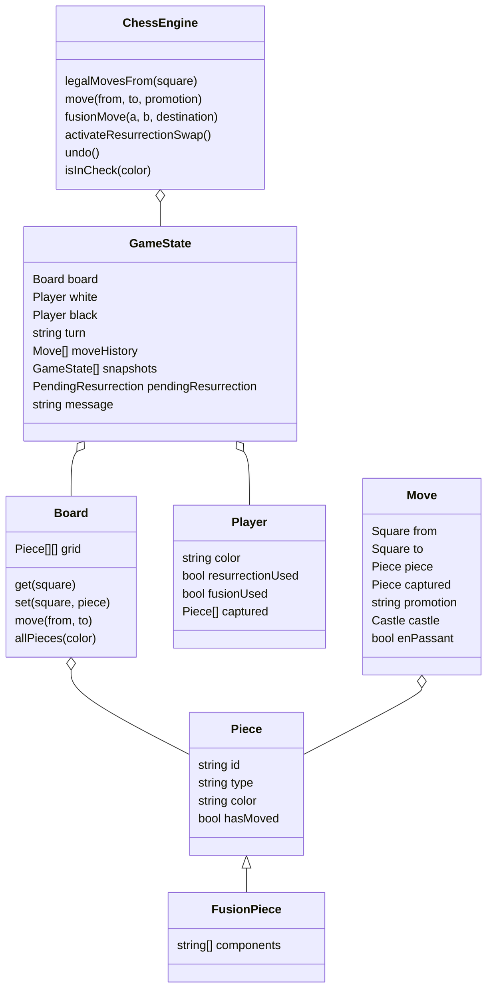

# Fusion Chess Architecture

## Overview

Fusion Chess is a local two-player browser game. The implementation separates the rules engine from the DOM UI:

- `src/engine.js` owns board state, legal move generation, check detection, custom abilities, history, and undo.
- `src/app.js` renders state, manages drag-and-drop/click input, promotions, and special-move dialogs.
- `src/styles.css` provides the responsive board and control layout.

## UML/Class Diagram



## Data Structures

- `Square`: `{ x: number, y: number }`, zero-based from White's left on Black's back rank.
- `Board.grid`: 8x8 array of `Piece | null`.
- `Piece`: base chess piece with type, color, id, and `hasMoved` for castling/pawn logic.
- `FusionPiece`: inherits `Piece` and stores movement components such as `["rook", "knight"]`.
- `Player`: tracks captured pieces and one-time ability flags.
- `Move`: stores normal move metadata plus castling/en-passant flags.
- `GameState`: single serializable state root plus snapshots for undo.

## State Management Strategy

The UI treats `ChessEngine.state` as the source of truth. Every committed action saves a cloned snapshot before mutation. `undo()` restores the most recent snapshot, including turn, ability flags, captured pieces, pending resurrection, and en-passant state.

Move validation uses pseudo-legal move generation followed by simulation. A move is legal only if the moving player's king is not in check after applying it. Fusion also simulates the resulting board to ensure a shielding piece was not illegally removed.

## Rule Engine

Standard rules supported:

- Legal movement for king, queen, rook, bishop, knight, and pawn.
- Check, checkmate, and stalemate.
- Castling with unmoved king/rook, empty path, no current check, and no attacked transit squares.
- En passant using a one-turn `enPassantTarget`.
- Promotion through a UI choice, defaulting to queen at the engine level.
- Illegal moves are rejected before mutation.

Custom rules:

- Resurrection Swap is offered immediately after a capture if unused. The captured piece is recreated with the capturer's color on the capture square, replacing the capturing piece. Kings are excluded.
- Fusion Move consumes a turn. A player selects two friendly non-king, non-fusion pieces, removes both, and creates one `FusionPiece` on either source square. The piece can move as any inherited component.

## Extensibility

New variants can be added by introducing more ability methods on `ChessEngine` or by extracting abilities behind a `SpecialMove` interface:

```js
class SpecialMove {
  canUse(gameState, player) {}
  apply(gameState, payload) {}
}
```

Because the UI already reads ability availability from engine state, additional abilities can be surfaced as more command buttons without changing board rendering.

## Edge Cases

- Fusion cannot include kings or existing Fusion Pieces.
- Fusion is rejected if removing either source piece exposes the current player's king.
- Resurrection cannot be delayed; the pending choice blocks normal play until used or declined.
- Captured Fusion Pieces are added to the captured list but Resurrection recreates them as a new owned Fusion Piece only if the ability is used immediately.
- Castling is blocked by attacked transit squares, occupied path squares, moved rooks, moved kings, or current check.
- En passant capture removes the pawn from its actual square, not the destination square.
- A promoted pawn can be used in later Fusion Moves as its promoted piece type.

## UI Wireframe

```text
+--------------------------------------------------+ +----------------------+
| Fusion Chess                         [Undo]      | | Special Moves        |
| White to move                                     | | [Fusion] [Resurrect] |
|                                                  | +----------------------+
| +---+---+---+---+---+---+---+---+                | | Captured             |
| |   chess board with legal highlights |          | | By White: pieces     |
| +---+---+---+---+---+---+---+---+                | | By Black: pieces     |
|                                                  | +----------------------+
| Drag pieces or click source/destination           | | Move History         |
+--------------------------------------------------+ +----------------------+
```
